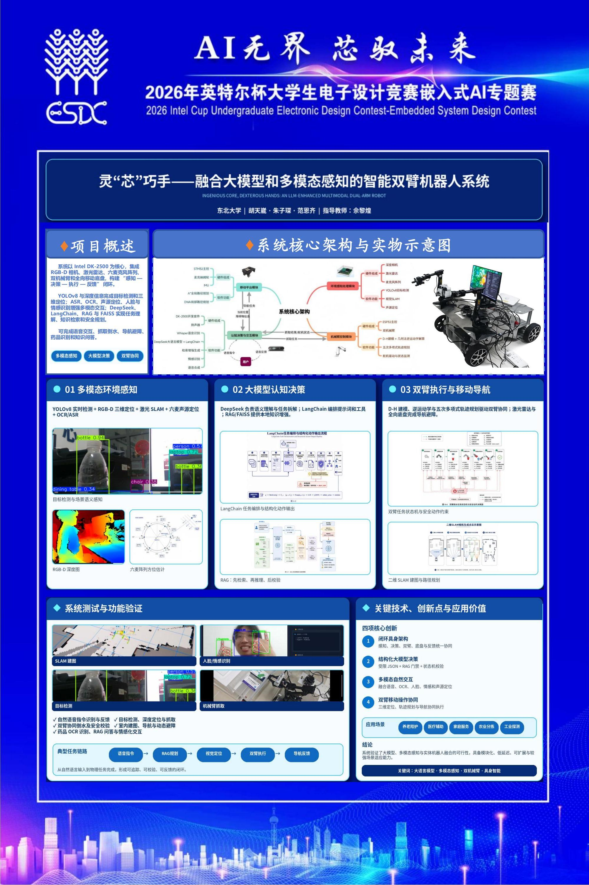

<!-- GitHub Profile README | 仓库名：Paxnoli/Paxnoli -->

<h1>范恩齐 Paxnoli</h1>
<h3>AI Robotics · 3D Vision · Multimodal Intelligence</h3>

> **以感知理解世界，以智能驱动行动。**

---

## 👤 关于我

> 关注人工智能与智能系统，希望通过计算机视觉、大语言模型和机器人技术，构建兼具**环境感知、任务理解与自主执行能力**的智能系统。

| 🎓 教育背景 | 📍 基本信息 |
| :--- | :--- |
| **东北大学** 通信工程专业 · 本科生 | 所在地：中国 邮箱：15668969293@163.com |
| **📚 英语能力** | **🎯 推免院校** |
| **CET-6** · 492 分 | **北京理工大学** |

---

## 🔬 研究方向与技术栈

| 方向 | 关键能力 |
| :---: | :--- |
| 🤖 **智能机器人** | 机器人控制 · SLAM · 自主导航 |
| 👁 **三维视觉** | 双目视觉 · 三维重建 · 点云处理 · OpenCV |
| 🧠 **多模态智能** | 大语言模型 · 智能推理 · 人机交互 · PyTorch |
| ⚡ **嵌入式智能** | 模型部署 · 边缘计算 · 智能硬件 |

---

## 🏆 获奖经历

| 年份 | 竞赛与项目 | 成果 |
| :---: | :--- | :---: |
| `2026` | **“英特尔杯”全国大学生电子设计竞赛嵌入式 AI 专题赛** | 🥈 全国二等奖 |
| `2026` | **中国机器人及人工智能大赛** | 🥈 全国二等奖 |
| `2026` | **全国大学生创新创业训练计划项目** | 🚀 国家级项目 |
| `2025` | **“高教社杯”全国大学生数学建模竞赛** | 🥉 辽宁省三等奖 |

---

## 🚀 项目经历

### 🤖 多模态人工智能双臂机器人系统

设计并实现一套融合**视觉感知、大语言模型推理与机器人控制**的多模态智能双臂机器人系统。系统面向复杂环境下的人机交互任务，实现机器人从环境理解到自主执行的智能化过程。

<b>查看系统架构与个人贡献</b>

 

| 👁 视觉感知 | 🧠 智能决策 | 🦾 机器人执行 |
| :---: | :---: | :---: |
| 人脸识别 表情识别 手势识别 目标检测 | DeepSeek 知识库 任务规划 | 目标抓取 双臂控制 自主导航 |

**个人贡献**

| 👁 视觉感知 | 🧠 智能交互 | 🦾 机器人控制 |
| :---: | :---: | :---: |
| 参与视觉算法模块设计 目标识别 人脸与表情识别 手势理解 | 大语言模型调用 知识库构建 自然语言任务解析 | 目标定位 机械臂控制 自主导航 |

### 📐 三维视觉点云重建系统

基于双目视觉技术，构建从二维图像采集、深度计算到三维点云生成的完整流程。该项目实现二维视觉信息向三维空间信息的转换，为机器人环境理解、目标定位与智能感知提供基础。

<b>查看技术架构与项目成果</b>

 

| 📷 图像采集 | 📏 深度计算 | ☁ 点云重建 |
| :---: | :---: | :---: |
| 双目图像获取 相机标定 图像预处理 | 特征提取 立体匹配 视差计算 | 三维坐标恢复 点云生成 空间分析 |

---

## 📰 成长记录

| 时间 | 记录 |
| :---: | :--- |
| `2026.07` | **🏆 嵌入式 AI 专题赛** · 与朱子琛、胡天崴前往上海交通大学参赛，最终荣获全国二等奖。 |
| `2026.04` | **🚀 国家级大创项目** · 作为项目负责人，与孙逢阳、赵熠佳、任美涵、牟王希组成团队，项目由校级资助项目获评国家级项目。 |
| `2025.09` | **📐 数学建模竞赛** · 与张修齐、孙逢阳组队参赛，获得辽宁省三等奖。 |

---

## 📊 GitHub 数据

  

  

---

## 📫 联系方式

| 📧 邮箱 | 🎓 学校 | 🎯 推免院校 |
| :---: | :---: | :---: |
| 15668969293@163.com | 东北大学 | 北京理工大学 |

---

### 持续学习 · 持续探索 · 持续创造

Thanks for visiting.

