<!-- GitHub Profile README | Paxnoli -->
<!-- 使用前请确保仓库名为 Paxnoli，并保持 assets/ 与 image/ 的相对路径不变。 -->

<a href="https://github.com/Paxnoli">
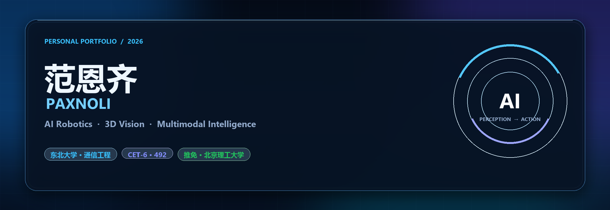
</a>

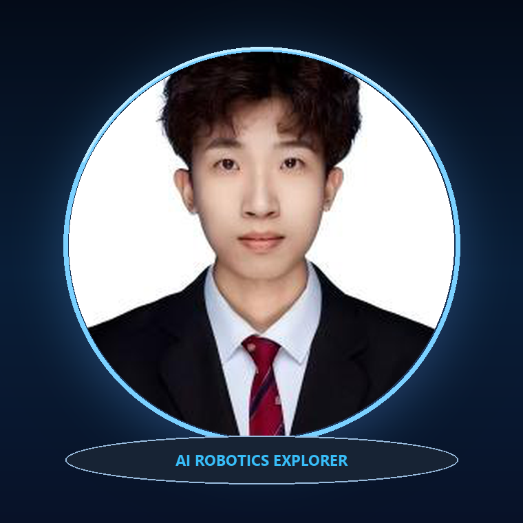

 

## 01 · 个人简介

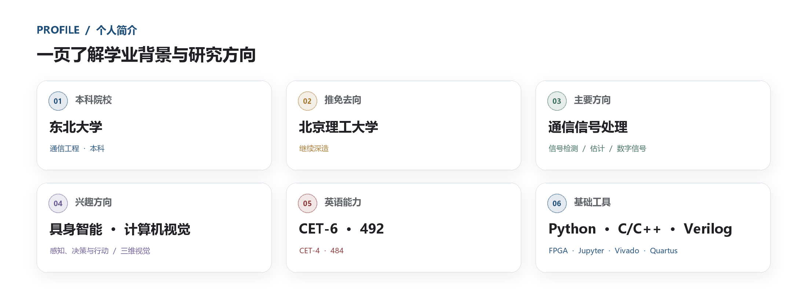

**核心信息**

`东北大学` · `通信工程` · `中国 · 辽宁沈阳` · `CET-6 492` · `推免北京理工大学`

### 技能矩阵

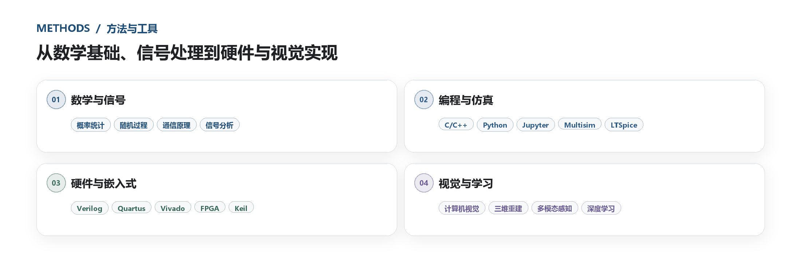

## 02 · 荣誉奖项

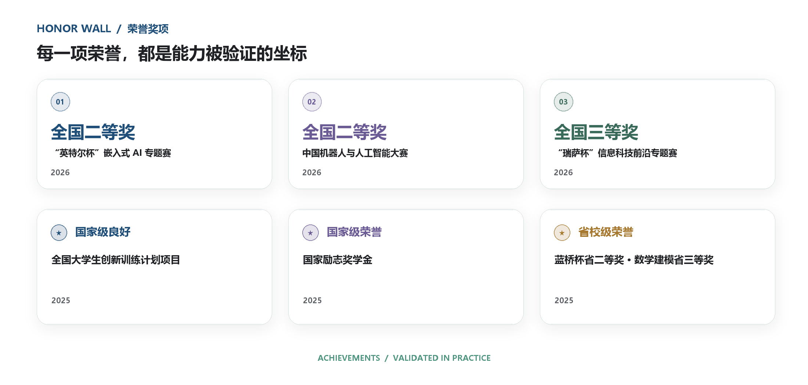

<b>展开查看完整荣誉清单</b>

 

| 年份 | 奖项与荣誉 | 级别 / 成果 |
| :---: | :--- | :---: |
| `2026` | “英特尔杯”全国大学生电子设计竞赛嵌入式 AI 专题赛 | 🥈 全国二等奖 |
| `2026` | 中国机器人与人工智能大赛 | 🥈 全国二等奖 |
| `2026` | “瑞萨杯”全国大学生电子设计竞赛信息科技前沿专题赛 | 🥉 全国三等奖 |
| `2025` | 全国大学生创新训练计划项目 | 国家级良好 |
| `2025` | 国家励志奖学金 | 国家级荣誉 |
| `2025` | “蓝桥杯”全国软件大赛单片机组 | 省级二等奖 |
| `2024 / 2025` | 全国大学生数学建模竞赛 | 省级三等奖 |
| `2025 / 2026` | 校优秀学生二等奖学金 | 校级荣誉 |
| `2025` | 校优秀学生干部 · 校优秀团员 | 校级荣誉 |

<b>展开查看全国二等奖获奖证书</b>

 

<table>
<tr>
<td width="42%" valign="top">
<a href="./image/robot/英特尔杯获奖证书.jpg">
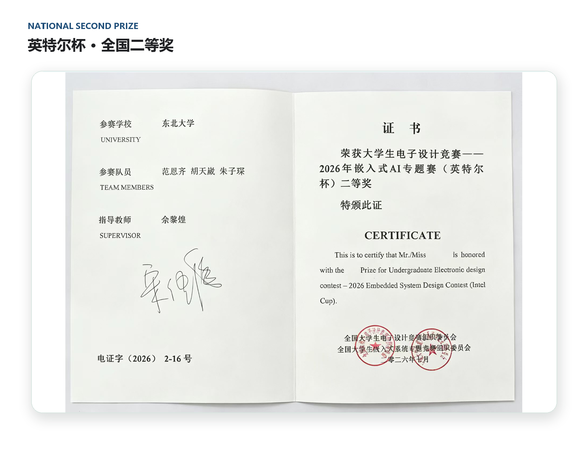
</a>
</td>
<td width="58%" valign="top">
<a href="./image/robot/CRAIC获奖证书.png">
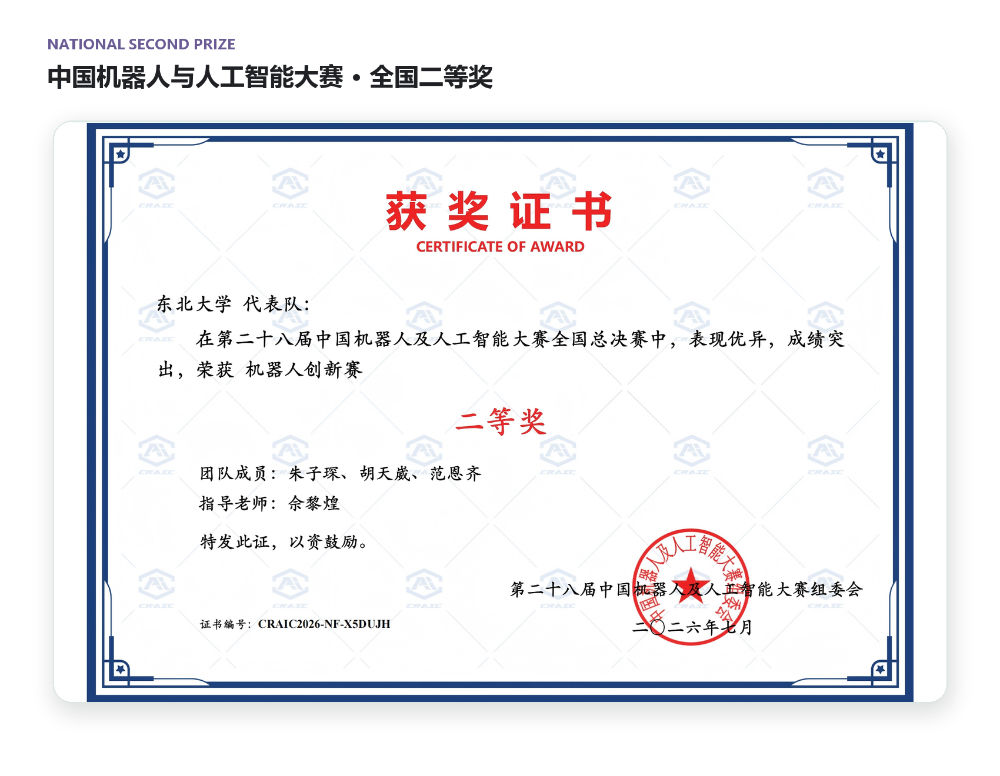
</a>
</td>
</tr>
</table>

## 03 · 项目经历

### 🤖 融合大模型和多模态感知的智能双臂机器人系统

`2024.11 — 2026.07`　`核心研发成员`　`国家级大学生创新训练计划`

项目融合计算机视觉、多模态感知与大模型认知推理，构建具备情感理解、自然交互和自主执行能力的双臂机器人系统。我主要负责视觉交互算法、三维识别定位、大模型集成与 SLAM 导航相关工作。

**个人贡献**

- 独立负责人脸识别、表情识别与静态手势识别算法的设计及系统实现
- 协作完成物体三维识别、抓取定位与双臂协同路径规划
- 调用 DeepSeek API 与本地知识向量库，完成任务解析和动态规划
- 参与构建激光 SLAM 地图、移动导航和自主避障模块

**项目成果**

`国家级大创良好` · `英特尔杯全国二等奖` · `中国机器人与人工智能大赛全国二等奖`

<table>
<tr>
<td width="38%" valign="top">
<a href="./image/robot/项目海报.jpg">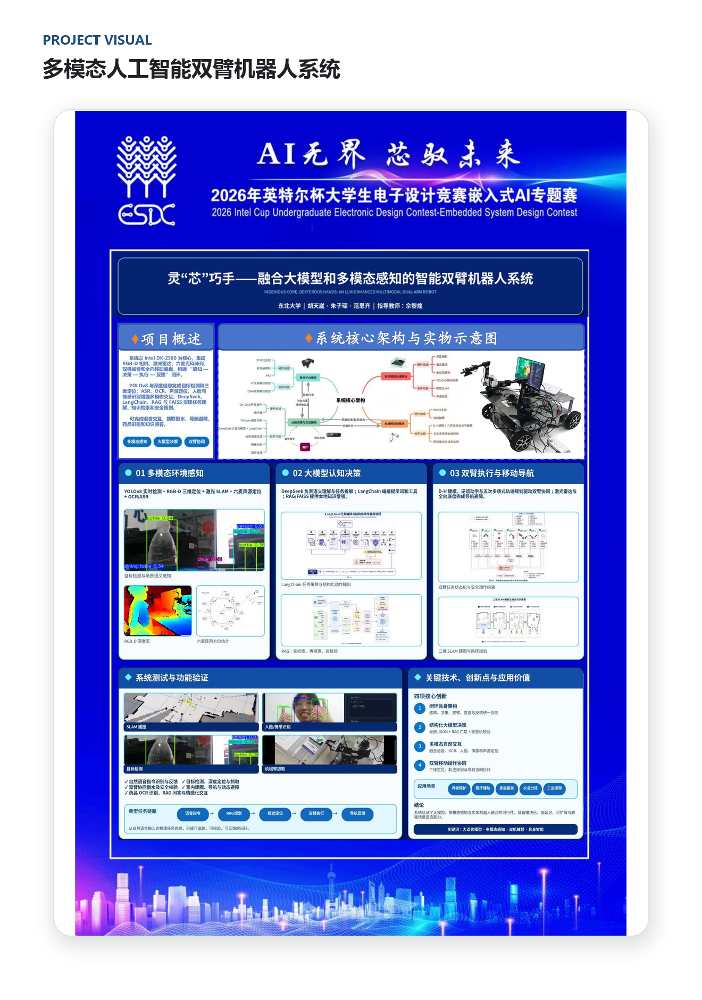</a>
</td>
<td width="62%" valign="top">
<a href="./image/robot/参赛团队合影.png">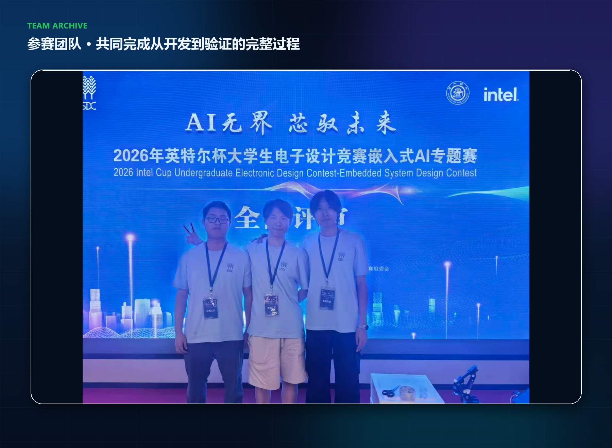</a>
</td>
</tr>
</table>

### 📐 智“绘”立方 · 嵌入式双目三维实景成像系统

`2025.11 — 至今`　`项目负责人`　`国家级大学生创新训练计划重点项目`

项目基于视觉 SLAM 与双目立体视觉，打通图像采集、立体校正、稠密点云生成与嵌入式端侧部署流程。我独立设计并实现双目立体匹配算法，完成特征点检测、最近邻匹配与亚像素视差计算。

**项目成果**

`国家级创新训练计划` · `“瑞萨杯”信息科技前沿专题赛全国三等奖` · `核心技术验证完成`

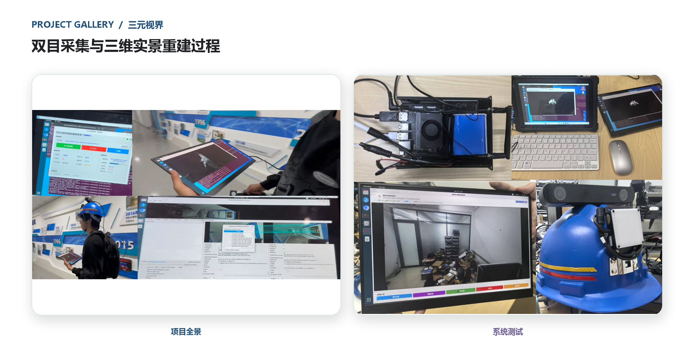

**其他项目实践**

| 项目 | 角色与成果 |
| :--- | :--- |
| 基于嵌入式 GPU 的深度学习算法设计与实现 | 项目负责人 · 完成模型压缩与移植 · 科研训练优秀项目 |
| 数字水印多媒体版权保护系统 | 项目负责人 · 基于 DCT 的鲁棒水印系统 · 生产实习优秀项目 |

## 04 · 个人发展历程

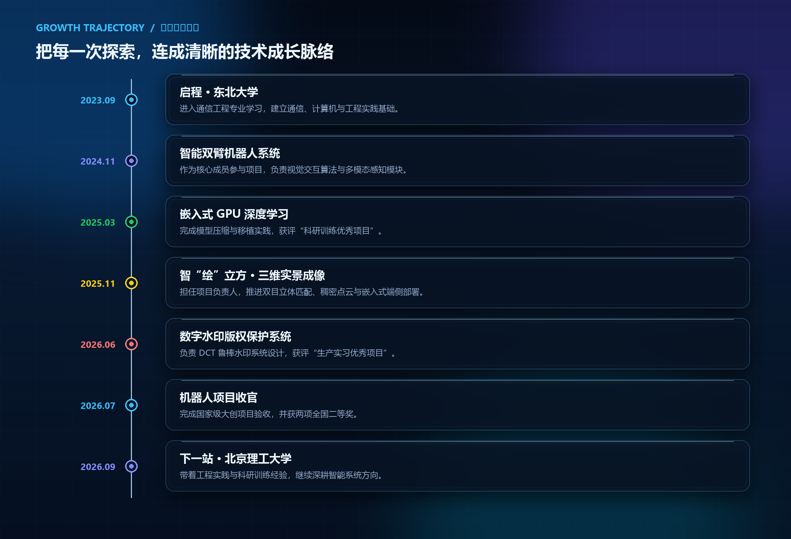

## 05 · 自我评价

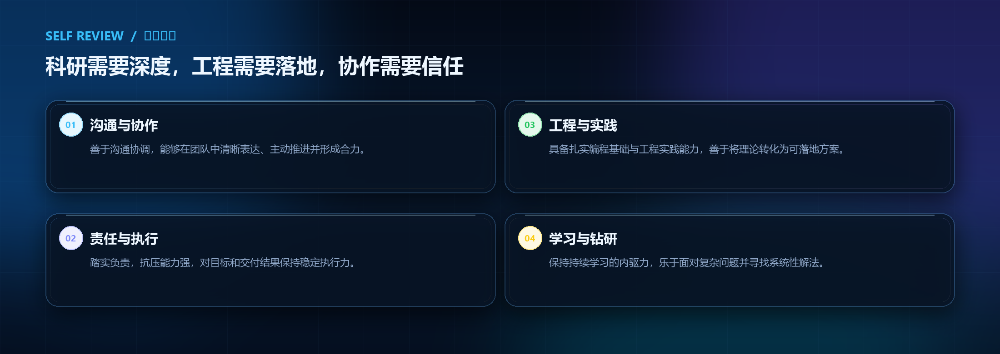

> 科研需要深度，工程需要落地，协作需要信任。我希望保持踏实、开放和持续学习的状态，在真实问题中不断验证并提升自己。

## 06 · 未来展望

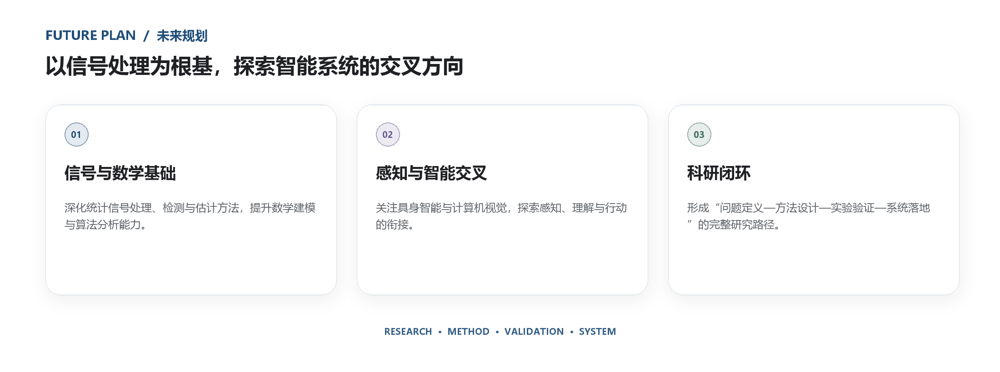

未来将在北京理工大学继续学习与研究，围绕**智能系统、三维视觉、多模态感知与机器人技术**持续积累，努力打通从感知理解到自主行动的完整技术链路，让研究成果真正走向可验证、可应用的真实场景。

## 07 · 访客记录

  

  

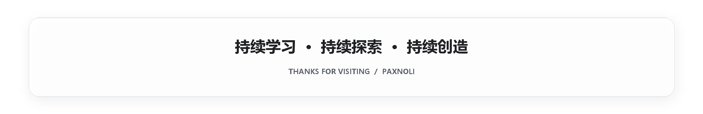

